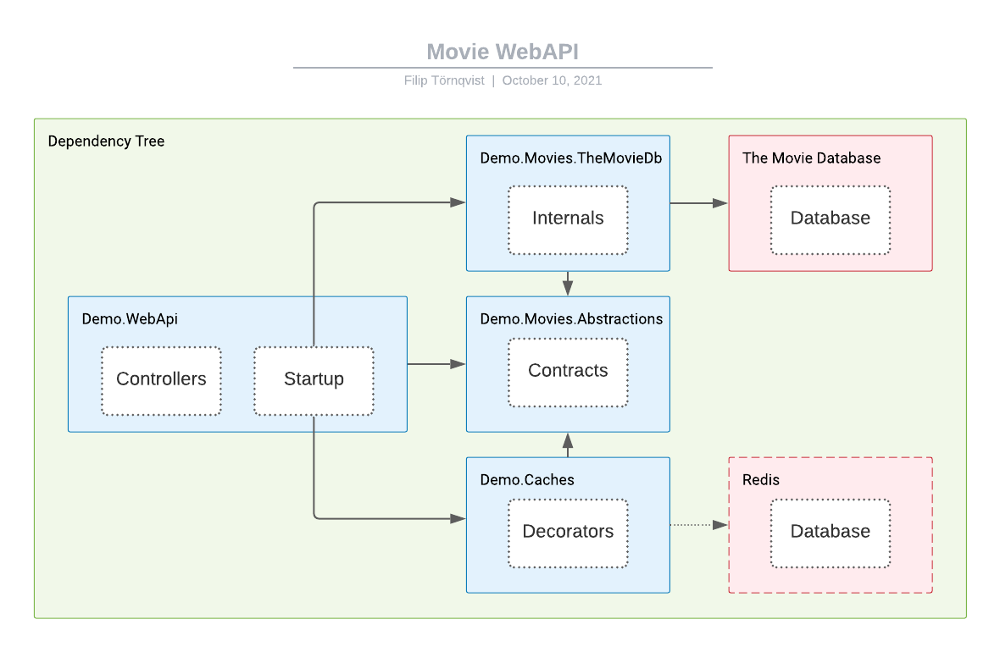

Demo.Movies
===========

Demo.Movies is a WebAPI demo used to showcase best practices for designing large-scale AspNetCore applications.

## Getting started

### 1. Configuration

Configure the following keys using any of the standard configuration methods (AppSettings, User Secrets, command line arguments, etc).

| Key | Description |
| - | - |
| TheMovieDatabase:ApiKeyV3 | This is the API key used to access TheMovieDatabase |
| Caches:Movies:InMemoryAbsoluteExpiration | This is the cache expiration time used for movies |

### 2. Starting

Press run in visual studio to start the application using IISExpress.

## Technical choices

### Tools

#### API Versioning (Microsoft.AspNetCore.Mvc.Versioning.ApiExplorer)

Versioning is used to allow for seamless migrations to new API versions that are not backwards compatible. The versioning is using URL segment as the only acceptable way to choose version to keep the contract concise.

#### Swagger (Swashbuckle.AspNetCore)

Swagger and redirect to swagger is used to allow for quick and easy usage and manual testing of the API. Swagger also exposes an OpenAPI json which contains the full specification of the API interface, this can be used to either manually or automatically implement a client for this API.

#### MemoryCache (Microsoft.Extensions.Caching.Memory)

MemoryCache is used as the default cache implementation for in-memory-caching. Mainly because it's widely used and works very well for it's purpose.

#### OptionsMonitor (Microsoft.Extensions.Options)

OptionsMonitor is used to allow for runtime updates of configuration which is useful to maintain applications with high uptime.

#### Decorate (Scrutor)

Scrutor is used exclusively to access the decorate extension method, this could be imported from some other library or implemented manually.

#### TMDbClient (TMDbLib)

The TMDbClient is used because it was a self-contained, lightweight and popular client implementation for TheMovieDatabase.

### Localizations

Localizations is currently not supported but it could be added through the RequestLocalization middleware using either Accept-Language or a query parameter.

## Structural concepts

#### *.Abstractions projects & namespaces

Abstractions projects are used to create a real separation of concerns (SoC). This allows the dependent projects to be completely unaware of the implementation of it's dependencies, meaning a future implementation of Demo.Movies.Abstractions can choose to use ElasticSearch without ever having to modify or even consider the dependant projects. The abstractions namespace is a lite version of the abstractions projects intended to be used as an internal alternative, it enabled a quick future migration to using abstractions projects whenever the specifications change with the added benefit of enforcing a consistent project structure.

#### *.(Implementation) projects

Implementation projects are used to define internals and are intended to only be used indirectly.

#### Demo.Caches

The cache project is caching data through decorators. The reason decorators are used is to have the caching only be dependent on the public interface and have no knowledge of the underlying implmentation, aka SoC. While the cache could theoretically be used directly in each implementation project, as is often done, this quickly leads to code that is very hard to reason about which ultimately increases development costs. A possible improvement to the caching project would likely be to split it into three or more projects for this solution, see example below.

Example projects
* Demo.Caching.Abstractions - (ICacheManager)
* Demo.Caching.Default (Implementation of ICacheManager, currently only MemoryCache)
* Demo.Movies.Caching (Movies decorator)

## Dependency graph 

With optional redis example.

## Tests

### Demo.Caches.Tests

UnitTests for the caches.

### Demo.Movies.TheMovieDb.Tests

These UnitTests verify both the compliance to Demo.Movies.Abstractions as well as the underlying implementations resilience by mocking both the external API and the mapper, testing each service individually. This type of granular testing is generally only necessary if the project has a very low error tolernace, a more time efficient path would be to only run tests on the public interface.

### Demo.WebApi.Tests

These UnitTests verify that the controllers work as intended. It is also reasonable to add E2E tests here.
